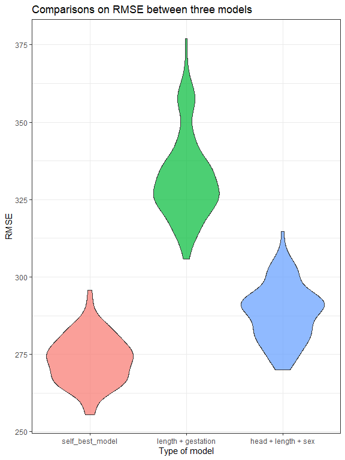

p8105\_hw6\_jg4197
================
Jin Ge
11/14/2019

## tidiness and construct a chosen model

``` r
## clean and tidy the data
child_weight <- read_csv("./data_for_hw6/birthweight.csv") %>% 
  janitor::clean_names() %>% 
  drop_na() %>% 
  mutate(babysex = factor(babysex, labels = c("male", "female")),
         frace = factor(frace, levels = c(1, 2, 3, 4, 8, 9),
                        labels = c("white", "black", "asian", "puerto", "other", "unknown")),
         malform = factor(malform, levels = c(0, 1),
                          labels = c("absent", "present")),
         mrace = factor(mrace, levels = c(1, 2, 3, 4, 8),
                        labels = c("white", "black", "asian", "puerto", "other")),
         parity = factor(parity),
         pnumlbw = factor(pnumlbw),
         pnumsga = factor(pnumsga),
         smoken = factor(smoken))
  
## propose self-regression model for birthweight
# interested in mother's weight at delivery and presence of malformation
child_self <- child_weight %>% 
  select(bwt, delwt, malform)

self_model <- child_self %>% lm(bwt ~ delwt + malform, data = .)

child_self <- child_self %>% 
  add_predictions(self_model) %>% 
  add_residuals(self_model)

# show plot b/w prediction and residuals
child_self %>% 
  ggplot(aes(x = pred, y = resid)) + geom_point(alpha = .8, color = "purple") +
  geom_hline(yintercept = 0, color = "red", size = .7) + 
  labs(title = "Residuals vs fitted value plot",
       X = "Predicted fitted value", 
       y = "Residual value")
```

<!-- -->

## constrcut two compared models and do comparisons

``` r
# Do comparisons
cv_df <- crossv_mc(child_weight, 100) %>% 
  mutate(train = map(train, as_tibble),
         test = map(test, as_tibble))


cv_df <- cv_df %>% 
  mutate(self_model = map(train, ~lm(bwt ~ delwt + malform, data = .x)), 
         comp1_model = map(train, ~lm(bwt ~ blength + gaweeks, data = .x)),
         comp2_model = map(train, ~lm(bwt ~ bhead + blength + babysex + bhead * blength + bhead * babysex + blength * babysex + bhead * blength * babysex, data = .x)))%>% 
  mutate(rmse_self = map2_dbl(self_model, test, ~rmse(model = .x, data = .y)),
         rmse_comp1 = map2_dbl(comp1_model, test, ~rmse(model = .x, data = .y)),
         rmse_comp2 = map2_dbl(comp2_model, test, ~rmse(model = .x, data = .y)))

# visualization
cv_df %>% 
  select(starts_with("rmse")) %>% 
  pivot_longer(
    everything(),
    names_to = "model", 
    values_to = "rmse",
    names_prefix = "rmse_"
  ) %>% 
  mutate(model = fct_inorder(model)) %>% 
  ggplot(aes(x = model, y = rmse)) + geom_violin(aes(fill = model), alpha = .7) +
  scale_x_discrete(labels = c("mother's weight + malform", "length + gestation", "head + length + sex")) +
  labs(title = "Comparisons on RMSE between three models",
       x = "Type of model",
       y = "RMSE") +
  theme(legend.position = "none")
```

<!-- -->

## distribution of two estimates

``` r
weather_df = 
  rnoaa::meteo_pull_monitors(
    c("USW00094728"),
    var = c("PRCP", "TMIN", "TMAX"), 
    date_min = "2017-01-01",
    date_max = "2017-12-31") %>%
  mutate(
    name = recode(id, USW00094728 = "CentralPark_NY"),
    tmin = tmin / 10,
    tmax = tmax / 10) %>%
  select(name, id, everything())

## simple linear regression model
slr <- weather_df %>% lm(tmax ~ tmin, data = .)

## r square
r_square <- slr %>% broom::glance() %>% .[[1]]
r_square
```

    ## [1] 0.9115425

``` r
## log(beta0_hat, beta1_hat)
beta0_hat <- slr %>% broom::tidy() %>% .[[1,2]]
beta0_hat
```

    ## [1] 7.208502

``` r
beta1_hat <- slr %>% broom::tidy() %>% .[[2,2]]
beta1_hat
```

    ## [1] 1.039241

``` r
log_betahat <- log(beta0_hat*beta1_hat)
log_betahat
```

    ## [1] 2.013752

``` r
## Do bootstrap and show distribution

r_square <- weather_df %>%  
  bootstrap(n = 5000) %>% 
  mutate(
    slr_model = map(strap, ~lm(tmax ~ tmin, data = .x)),
    for_r = map(slr_model, broom::glance)
  ) %>% 
  select(-slr_model, everything()) %>% 
  unnest(for_r) %>% 
  select(id = .id, r.squared) 

r_square %>% 
  ggplot(aes(x =r.squared)) +
  geom_density(aes(fill = "pink"), size = 1.1) + 
  geom_vline(aes(xintercept = mean(r.squared)), color = "blue", linetype = "dashed", size = 1) +
  labs(title = "Distribution of r square in 5000 sampling",
       x = "r square",
       y = "Density") +
  theme(legend.position = "none")
```

<!-- -->

``` r
## left-skewed


beta_hat <- weather_df %>%  
  bootstrap(n = 5000) %>% 
  mutate(
    slr_model = map(strap, ~lm(tmax ~ tmin, data = .x)),
    for_betahat = map(slr_model, broom::tidy),
    for_betahat = map(for_betahat, as_tibble)
  ) %>% 
  select(-slr_model, everything()) %>% 
  unnest(for_betahat) %>% 
  select(.id, term, estimate)

estimate <- beta_hat %>% 
  filter(term == "tmin")

betahat_df <- beta_hat %>% 
  filter(term == "(Intercept)") %>% 
  full_join(estimate, by = ".id") %>% 
  select(id = .id, intercept = estimate.x, tmin = estimate.y) %>% 
  mutate(log_betahat = log(intercept*tmin)) %>% 
  select(-intercept, -tmin) 

betahat_df %>% 
  ggplot(aes(x = log_betahat)) +
  geom_density(aes(fill = "yellow"), size = 1.1) +
  geom_vline(aes(xintercept = mean(log_betahat)),
            color = "blue", linetype = "dashed", size = 1) +
  labs(title = "Distribution of ln(beta0_hat*beta1_hat) in 5000 sampling",
       x = "ln(beta0_hat*beta1_hat)",
       y = "Density") +
  theme(legend.position = "none")
```

<!-- -->

``` r
## normal distribution
```

## give confidence intervals

``` r
## r_square
ci_r <- r_square %>% 
  summarize(mean = mean(r.squared),
    lower = mean(r.squared) - qnorm(0.975) * sd(r.squared),
    upper = mean(r.squared) + qnorm(0.975) * sd(r.squared))
ci_r
```

    ## # A tibble: 1 x 3
    ##    mean lower upper
    ##   <dbl> <dbl> <dbl>
    ## 1 0.911 0.895 0.928

``` r
## beta_hat
ci_beta <- betahat_df %>% 
  summarize(mean = mean(log_betahat),
    lower = mean(log_betahat) - qnorm(0.975) * sd(log_betahat),
    upper = mean(log_betahat) + qnorm(0.975) * sd(log_betahat))
ci_beta
```

    ## # A tibble: 1 x 3
    ##    mean lower upper
    ##   <dbl> <dbl> <dbl>
    ## 1  2.01  1.97  2.06
